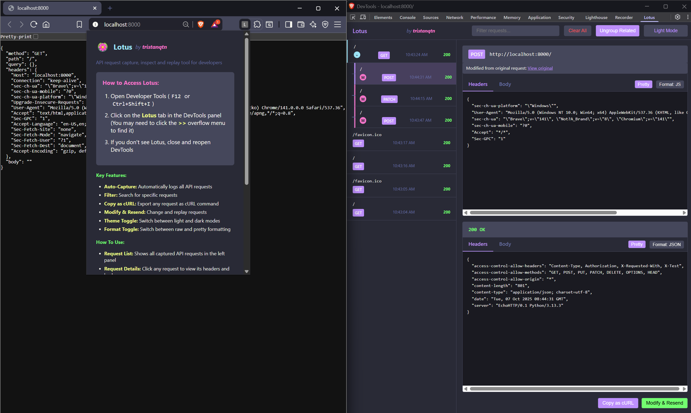

# Lotus 🪷

Lotus is a powerful browser extension for capturing, examining, modifying, and replaying web requests directly in your browser's DevTools. 

This tool has been created for lazy security guys like me that needs to quickly inspect and manipulate web requests without leaving the browser nor spining up Burp Suite or Postman. 

> [!NOTE] 
> This tool has been greatly inspired by other tools like Postman and Burp Suite and it does not aim to replace them. It is meant to be a lightweight alternative for quick tasks directly in the browser.

> [!NOTE]
> I had the idea of creating this tool while working on some CTF challenge where I needed to quickly manipulate and resend API requests. I wanted something lightweight that would integrate directly into my browser workflow without the overhead of larger tools. Thus, Lotus was born to fill that niche for quick and easy API request manipulation.



## Features

- 🪷 **API Request Monitoring**: Automatically captures all API requests made by the current tab.
- 🔍 **Request Inspection**: View complete request and response details including headers, parameters, and status codes.
- 📋 **Copy as cURL**: Export any captured request as a cURL command for use in your terminal or API documentation.
- 🔄 **Real-time Updates**: Requests are displayed in real-time as they occur.
- 🔎 **Filtering**: Quickly find specific requests with the built-in filter.
- 🔁 **Modify & Resend**: Edit captured requests and resend them to test API endpoints.
- 🌓 **Light/Dark Mode**: Switch between light and dark themes based on your preference.
- 🔄 **Raw/Pretty Toggle**: View response data in raw format or beautifully formatted JSON.
- 🔗 **Request Relationships**: Track parent-child relationships between original and modified requests.
- 👥 **Request Grouping**: Toggle between flat view and hierarchical view for related requests.

## New Features

### Request Relationship Tracking

Lotus now provides a powerful way to track relationships between original requests and their modified versions:

- 🔗 **Visual Indicators**: Modified requests and their originals are clearly marked with color-coded borders and icons
- 📋 **Parent-Child Relationships**: Navigate easily between original requests and their modified versions
- 📊 **Grouping**: Toggle between flat view and hierarchical view to organize related requests
- 🔄 **Source Tracking**: Requests are labeled based on their source (page or modified)

### Modify & Resend

Edit any captured request and send it again with modified parameters. This is particularly useful for:

- Testing different API payloads without changing your code
- Troubleshooting by isolating request issues
- Exploring API behavior with different inputs

### Theme Support

- **Dark Mode (Default)**: A beautiful Dracula-inspired dark theme that's easy on the eyes for long development sessions
- **Light Mode**: A clean, professional light theme for high-contrast environments
- Your theme preference is remembered between sessions

### Formatting Options

Toggle between pretty-formatted and raw data views:

- **Pretty**: JSON data is automatically formatted with proper indentation and syntax highlighting
- **Raw**: See the exact data as sent or received over the wire, ideal for debugging serialization issues

### Request Relationship Features (v2.0)

The new relationship tracking system helps you keep track of original requests and their modified versions:

- **Visual Indicators**: 
  - Modified requests are marked with a pink border and an "M" badge
  - Original requests with modifications have a cyan border and a "+" badge
  
- **Relationship Navigation**:
  - When viewing a modified request, you can quickly navigate to its original request
  - When viewing an original request with modifications, you can see and navigate to all its modified versions
  
- **Request Grouping**:
  - Toggle between flat view and hierarchical view with the "Group Related" button
  - In grouped view, modified requests appear indented under their original requests
  - Visual connecting lines show the relationship between parent and child requests

## Browser Compatibility

Lotus primarily works with Chromium-based browsers:

- ✅ Google Chrome (primary development platform)
- ✅ Microsoft Edge
- ✅ Brave
- ✅ Opera
- ✅ Vivaldi
- ❌ Firefox (not compatible due to different extension API)
- ❌ Safari (not compatible due to different extension API)

## Installation

1. Clone this repository or download the source code.
2. Open a Chromium-based browser and navigate to `chrome://extensions/` (or the equivalent in your browser).
3. Enable "Developer mode" in the top-right corner.
4. Click "Load unpacked" and select the Lotus directory.

## Usage

1. Open DevTools (F12 or right-click > Inspect).
2. Navigate to the "Lotus" panel (you may need to click the "»" overflow menu to find it).
3. Browse the website as normal - all API requests will be automatically captured.
4. Click on any request in the sidebar to view its details.
5. Use the features:
   - **Copy as cURL**: Copy the request as a cURL command for use in your terminal
   - **Modify & Resend**: Change request parameters and send a new request
   - **Theme Toggle**: Switch between dark (Dracula) and light themes
   - **Format Toggle**: Switch between raw and prettified data views

## How It Works

Lotus utilizes the Chrome DevTools Protocol and Extension APIs to intercept, analyze, and manipulate network requests:

1. **Request Capture**: The background script (`background.js`) uses the `chrome.webRequest` API to monitor all outgoing HTTP requests from the current tab.

2. **Data Processing**: Captured requests are processed, with headers and body information extracted and formatted for display.

3. **DevTools Integration**: The extension adds a custom panel to Chrome DevTools where the UI is rendered.

4. **Real-time Communication**: A persistent connection between the DevTools panel and the background script ensures that new requests appear in real-time.

5. **Response Body Capture**: The extension attempts to capture response bodies through a combination of the webRequest API and fetch API when possible.

6. **Storage and State**: Request data is temporarily stored in memory and persisted using `chrome.storage.local` to survive extension restarts.

## Development

To modify or enhance Lotus:

1. Edit `background.js` to change how requests are captured and processed.
2. Edit `panel.js` and `panel.html` to modify the DevTools panel UI.
3. Edit `panel.css` for styling changes and theme modifications.
4. Edit `lib/utils.js` for utility functions used across the extension.
5. Edit `popup.html` to modify the extension popup UI and documentation.
6. Reload the extension in `chrome://extensions/` after making changes.

### Project Structure

```
background.js        # Background script for request interception
devtools.html        # DevTools page setup
devtools.js          # Registers the DevTools panel
manifest.json        # Extension configuration
panel.css           # Styles for the DevTools panel
panel.html          # HTML structure of the DevTools panel
panel.js            # Main UI logic for the panel
popup.html          # Extension popup with documentation
lib/
  utils.js          # Shared utility functions
```

## License

This project is open source and available under the [MIT License](LICENSE).

## Troubleshooting

### Lotus Panel Not Visible

If you don't see the Lotus panel in DevTools:

1. Close and reopen DevTools
2. Check the "»" overflow menu to see if Lotus is hidden there
3. Try disabling and re-enabling the extension in `chrome://extensions/`
4. Ensure you have the latest version of your browser

### Request Data Not Appearing

If you're not seeing API requests in Lotus:

1. Confirm the requests are actually being made (check Network tab)
2. Some requests from other extensions or service workers might not be captured
3. Try refreshing the page to restart the capturing process

### Other Issues

- For CORS-related issues, remember that Lotus can only access what the browser's Network API provides
- Large response bodies might be truncated in the display
- For secure contexts (https), more request data is available than for insecure contexts

## Development

### CI/CD Pipelines

Lotus uses GitHub Actions for automation, providing the following CI/CD pipelines:

#### Automated Testing & Linting
- Runs on every push and pull request
- Validates code quality and style
- Ensures tests pass before merging

#### Automated Releases
- When code is pushed to the main branch, a new release is created automatically
- The version number is taken from the `manifest.json` file
- The extension is packaged into a ZIP file and attached to the GitHub release
- Release notes are generated automatically from commit messages

#### Security Scanning
- Weekly security audits for dependencies
- Runs on every push to main branch
- Flags potential security issues

#### Dependency Updates
- Weekly automated checks for outdated dependencies
- Creates pull requests for updates when needed

### Creating a New Release

To create a new release:

#### Automatic Method
1. Use the version bump script:
   ```
   node scripts/bump-version.js [major|minor|patch]
   ```
   This will update the version in both `manifest.json` and `package.json`

2. Commit and push your changes to the main branch:
   ```
   git commit -am "Bump version to x.x.x"
   git push origin main
   ```

3. GitHub Actions will automatically:
   - Run tests and linting
   - Build the extension package
   - Create a GitHub release with the package attached
   - Generate release notes from commit messages

#### Manual Method
1. Update the version in `manifest.json`
2. Update the version in `package.json`
3. Push your changes to the main branch

### Contributing

Please see [CONTRIBUTING.md](./CONTRIBUTING.md) for details on how to contribute to this project.

## Credits

- Dracula theme colors inspired by the [Dracula Theme](https://draculatheme.com/)
- Icons and styling based on modern design practices for developer tools

---

If you find Lotus useful, consider starring the repository and contributing to its development!
