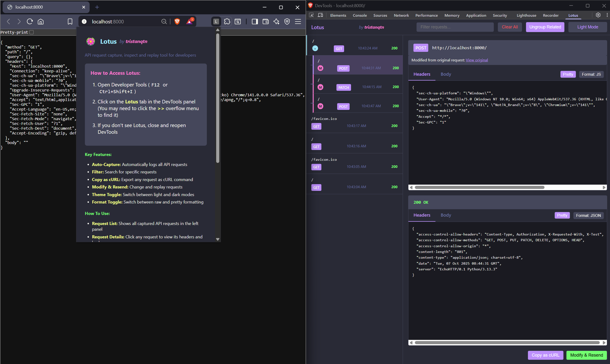

# Lotus

A Chrome DevTools extension for capturing, inspecting, modifying, and replaying HTTP requests — without leaving the browser.

Built for developers and security folks who need quick request manipulation without spinning up Burp Suite or Postman.



## Features

| Feature | Description |
|---|---|
| **Auto-Capture** | All HTTP requests from the inspected tab logged in real time |
| **Full Capture** | Response bodies for all methods (POST/PUT/PATCH/DELETE) via Chrome debugger API |
| **Filter** | URL/method substring filter with regex toggle + 2xx/3xx/4xx/5xx status buttons |
| **Modify & Resend** | Edit any request in a side-by-side original/modified modal and replay it |
| **Diff** | Side-by-side diff of headers and body between an original and its modified version |
| **Copy as cURL** | One-click export of any request as a `curl` command |
| **Format Toggle** | Pretty/Raw view with format selector: JSON, XML, HTML, JavaScript, CSS |
| **Request Grouping** | Hierarchical view linking original requests to their modified versions |
| **Pause / Resume** | Stop capture without clearing history |
| **Persistent State** | Requests survive panel reloads via `chrome.storage.local` |

## Installation

1. Clone or download this repository.
2. Open `chrome://extensions/` and enable **Developer mode**.
3. Click **Load unpacked** and select the repo root.
4. Open DevTools (`F12`), find the **Lotus** tab (use the `>>` overflow menu if needed).

Works on Chrome, Edge, Brave, and other Chromium-based browsers. Firefox is not supported (`chrome.*` APIs throughout).

## Usage

1. Open the **Lotus** panel in DevTools.
2. Browse the page — requests appear automatically in the sidebar.
3. Click a request to inspect its headers and body.
4. Use the toolbar buttons:
   - **Full Capture** — attaches Chrome's debugger to the tab so response bodies are captured for all HTTP methods, not just GET.
   - **Filter** — type to filter by URL or method; click `.*` to switch to regex; click status badges to show only 2xx/3xx/4xx/5xx.
   - **Pause** — temporarily stop recording without losing history.
   - **Group Related** — switch to a hierarchical view that nests modified requests under their originals.
5. With a request selected, use the action buttons:
   - **Copy as cURL** — copies a `curl` command to the clipboard.
   - **Modify & Resend** — opens a two-column modal showing the original and editable values side by side; changed fields are highlighted in orange.
   - **Diff** — opens a side-by-side diff view (only enabled for modified requests with an available original).
   - **Delete Request** — removes the request and any of its modified children.

## Architecture

Two execution contexts communicate via Chrome's port API.

**`background.js`** — service worker that owns all network interception and storage.
- `chrome.webRequest` pipeline: `onBeforeRequest` → `onBeforeSendHeaders` → `onHeadersReceived` → `onCompleted`
- `chrome.debugger` pipeline (Full Capture mode): `Network.requestWillBeSent` → `Network.responseReceived` → `Network.loadingFinished` + `getResponseBody`. When a tab has the debugger attached, the webRequest pipeline is skipped for that tab.
- Stores requests in `chrome.storage.local` keyed by `tabId`, capped at 1 000 requests per tab.

**`panel.js` + `panel.html` + `panel.css`** — the DevTools panel UI.
- Receives requests over the port connection and renders them.
- Sends `DELETE`, `STORE`, `PAUSE`, `RESUME`, `FULL_CAPTURE_ENABLE`, `FULL_CAPTURE_DISABLE` messages back to the background.
- Preferences (grouping, format type) persisted via `chrome.storage.local`; Full Capture preference via `localStorage`.

**`lib/utils.js`** — shared helpers: `safeParseJSON`, `toHeaderObject`, `formatRequestBody`, `formatTextContent`.

```
background.js       # Request interception, CDP debugger, storage
devtools.html / .js # Registers the panel in DevTools
panel.html          # Panel markup
panel.js            # Panel logic
panel.css           # Dracula-themed styles
popup.html          # Extension popup (info only)
lib/utils.js        # Shared utilities
manifest.json       # MV3 manifest
```

## Development

```bash
npm run lint        # ESLint check
npm run lint:fix    # ESLint auto-fix
npm run build       # Package as dist/lotus.zip (Unix/macOS)
npm run build:win   # Package as dist/lotus.zip (Windows)
npm run version     # Sync version between manifest.json and package.json
```

After editing any file, reload the extension at `chrome://extensions/`.

## Release

Push to `main` triggers the GitHub Actions workflow: lint → build → create a GitHub Release with `dist/lotus.zip` attached. Version is read from `manifest.json`. To bump:

```bash
npm run version   # after editing manifest.json
git commit -am "chore: bump to x.y.z"
git push origin main
```

## License

MIT
